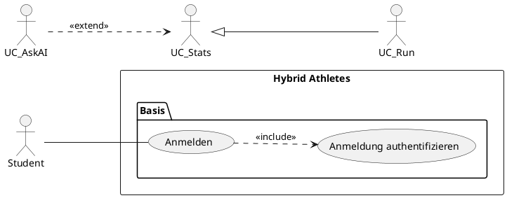

# PlantUML im Projekt

PlantUML erzeugt UML-Diagramme aus Textdateien. Eine `.puml`-Datei beschreibt Elemente und Beziehungen, ein Renderer macht daraus PNG oder SVG.

Für die Fallstudie Systemanalyse arbeiten wir so, weil Text sich versionieren lässt. Ein `git diff` zeigt, welche Beziehung dazugekommen ist. Bei einer Bilddatei aus einem Zeichenprogramm zeigt der Diff nur, dass sich die Datei geändert hat.

## Ablage

| Ort | Inhalt |
|---|---|
| [fallstudie_uml/](fallstudie_uml/) | Quellen und erzeugte Bilder |
| `*.puml` | die Quelle, wird bearbeitet |
| `*.png`, `*.svg` | erzeugt, liegen neben der Quelle |

Die Bilder sind mit eingecheckt, damit die Diagramme ohne installiertes Werkzeug lesbar sind. Nach jeder Änderung an einer `.puml` werden PNG und SVG neu erzeugt und mit committet.

## Einrichtung in VS Code

### 1. Java prüfen

```powershell
java -version
```

Erwartet wird Version 11 oder höher. Auf dem Rechner, auf dem diese Anleitung entstanden ist, läuft Java 21.0.9. Ohne Java gibt es Temurin unter <https://adoptium.net/>.

### 2. Erweiterung installieren

Die Erweiterung heißt **PlantUML**, Herausgeber **jebbs**, ID `jebbs.plantuml`.

Über die Oberfläche:

1. VS Code öffnen.
2. `Strg+Umschalt+X` für die Erweiterungen.
3. Nach `PlantUML` suchen.
4. Den Eintrag von jebbs installieren. Es gibt mehrere Erweiterungen mit ähnlichem Namen, der Herausgeber entscheidet.

Über die Kommandozeile:

```powershell
code --install-extension jebbs.plantuml
```

Getestet mit Version 2.18.1.

### 3. Einstellungen

Die Voreinstellungen passen. `plantuml.render` steht auf `Local`, die Erweiterung bringt ihre eigene `plantuml.jar` mit (Version 1.2024.3) und ruft sie über das Java aus dem `PATH` auf.

Graphviz muss man auf diesem Rechner nicht getrennt installieren. Prüfen lässt sich das mit:

```powershell
java -jar "$env:USERPROFILE\.vscode\extensions\jebbs.plantuml-2.18.1\plantuml.jar" -testdot
```

Erwartete Ausgabe:

```
Dot version: dot - graphviz version 2.44.1 (20200629.0846)
Installation seems OK. File generation OK
```

Meldet der Befehl einen Fehler, hilft Graphviz von <https://graphviz.org/download/>. Nach der Installation muss `dot.exe` im `PATH` stehen.

### 4. Vorschau öffnen

1. Eine `.puml`-Datei öffnen, etwa [fallstudie_uml/hybrid_athletes_usecase_v2.puml](fallstudie_uml/hybrid_athletes_usecase_v2.puml).
2. `Alt+D` drücken.

Die Vorschau erscheint rechts und aktualisiert sich beim Tippen.

### 5. Bild exportieren

`Strg+Umschalt+P`, dann `PlantUML: Export Current Diagram`. Das Format wird abgefragt. Die Erweiterung legt das Ergebnis unter `out/` ab.

Für dieses Projekt exportieren wir direkt neben die Quelle, siehe den nächsten Abschnitt.

## Rendern ohne VS Code

```powershell
$jar = "$env:USERPROFILE\.vscode\extensions\jebbs.plantuml-2.18.1\plantuml.jar"
java -jar $jar -charset UTF-8 -tpng fallstudie_uml\hybrid_athletes_usecase_v2.puml
java -jar $jar -charset UTF-8 -tsvg fallstudie_uml\hybrid_athletes_usecase_v2.puml
```

Das Bild landet neben der Quelldatei und heißt wie der Name hinter `@startuml`.

Nützliche Schalter:

| Schalter | Wirkung |
|---|---|
| `-charset UTF-8` | Umlaute in den Beschriftungen bleiben erhalten |
| `-tpng`, `-tsvg`, `-tpdf` | Ausgabeformat |
| `-testdot` | prüft die Graphviz-Anbindung |
| `-version` | Version von PlantUML, Java und Graphviz |

Ohne `-charset UTF-8` werden auf Windows aus "Daten löschen" und "App wählen" kaputte Zeichen.

## Alle Diagramme auf einmal erzeugen

[fallstudie_uml/render.sh](fallstudie_uml/render.sh) rendert jede `.puml` im Ordner nach PNG und SVG. Das Skript läuft in Git Bash, WSL, macOS und Linux.

```bash
cd fallstudie_uml
./render.sh
```

Falls das Ausführungsrecht fehlt, geht auch:

```bash
bash fallstudie_uml/render.sh
```

Das Skript arbeitet immer auf seinem eigenen Ordner. Das aktuelle Arbeitsverzeichnis spielt keine Rolle.

### Optionen

| Aufruf | Wirkung |
|---|---|
| `./render.sh` | alle `.puml` im Ordner |
| `./render.sh -r` | zusätzlich alle Unterordner |
| `./render.sh --png` | nur PNG |
| `./render.sh --svg` | nur SVG |
| `./render.sh a.puml b.puml` | nur die genannten Dateien |
| `./render.sh -h` | Hilfe |

`PLANTUML_JAR=/pfad/zu/plantuml.jar ./render.sh` nutzt eine andere Jar. `NO_COLOR=1` schaltet die Farbausgabe ab.

### Was das Skript prüft

1. Ist Java im `PATH`?
2. Findet sich eine `plantuml.jar`? Gesucht wird in `PLANTUML_JAR`, dann in den Erweiterungsordnern von VS Code, dann nach einem Befehl `plantuml` im `PATH`.
3. Meldet `-testdot` eine funktionierende Graphviz-Anbindung?
4. Je Datei: enthält sie `@startuml`, und ist die Syntax gültig?

Der Syntaxtest läuft über `plantuml -syntax`. Der liest von der Standardeingabe und schreibt keine Datei. Bei einem Fehler bleibt der Ordner damit frei von halben Bildern. Ein direkter Aufruf mit `-tpng` würde stattdessen ein PNG mit der Fehlermeldung darin ablegen.

### Ausgabe bei einem Syntaxfehler

```
FEHLER  beispiel.puml
        Zeile 6
        Syntax Error?
        Some diagram description contains errors
        > A ??? U
        Kein Bild geschrieben.

Zusammenfassung
  erzeugt:  2
  Fehler:   1

Fehlgeschlagen:
  beispiel.puml
```

Der Exit-Code ist 1, sobald eine Datei fehlschlägt. Ohne Fehler ist er 0.

### Hinweis zum Dateinamen

Der Name der Bilddatei kommt aus der Zeile `@startuml <name>`. Der Name der `.puml`-Datei bleibt dabei unberücksichtigt. Weichen beide voneinander ab, meldet das Skript das:

```
HINWEIS beispiel.puml
        @startuml heisst "anderer_name", die Datei heisst "beispiel".
        Die Bilder heissen deshalb anderer_name.png und anderer_name.svg.
```

Damit die Bilder wie ihre Quelle heißen, schreibt man denselben Namen in beide.

## Server-Rendering

Die Erweiterung kann Diagramme stattdessen auf einem Server rendern:

```json
{
  "plantuml.render": "PlantUMLServer",
  "plantuml.server": "https://www.plantuml.com/plantuml"
}
```

Das ist schneller und braucht kein Java. Dabei geht der Quelltext des Diagramms an plantuml.com. Für unsere Diagramme ist das unkritisch, die Entscheidung trifft aber jeder für sich.

## Team-Hinweis

`.vscode/` steht in [.gitignore](.gitignore). Editor-Einstellungen werden damit nicht mitverteilt. Jeder richtet die Erweiterung einmal lokal ein.

## Notation in unseren Diagrammen

Die Regeln stehen als Kommentar im Kopf jeder `.puml`-Datei. Kurzfassung:



| Element | Schreibweise | Darstellung |
|---|---|---|
| Akteur | `actor "Name" as Alias` | Strichfigur |
| Systemgrenze | `rectangle "Name" { }` | Rechteck |
| Gruppe | `package "Name" { }` | Rechteck mit Titel |
| Anwendungsfall | `usecase "Name" as Alias` | Ellipse |
| Assoziation | `A -- B` | durchgezogene Linie |
| include | `A ..> B : <<include>>` | gestrichelter Pfeil zum eingebundenen Fall |
| extend | `A ..> B : <<extend>>` | gestrichelter Pfeil zum Basisfall |
| Generalisierung | `A <\|-- B` | Linie mit hohler Dreiecksspitze |
| Kommentar | `' Text` am Zeilenanfang | erscheint im Bild nicht |

Ein Anwendungsfall kann mehrzeilig beschriftet werden. `--` allein auf einer Zeile zeichnet eine Trennlinie in der Ellipse:

```plantuml
usecase UC_Stats as "Statistiken einsehen
--
extension points
  Motivation angefragt"
```

## Layout steuern

Graphviz bestimmt die Anordnung. Wir beeinflussen sie über wenige Angaben. Warum sie in [hybrid_athletes_usecase_v2.puml](fallstudie_uml/hybrid_athletes_usecase_v2.puml) so gesetzt sind, steht im Kopf der Datei.

| Angabe | Wirkung |
|---|---|
| `left to right direction` | Akteure links, Anwendungsfälle nach rechts |
| `skinparam linetype ortho` | alle Kanten rechtwinklig |
| `skinparam nodesep`, `ranksep` | Abstand quer zur und längs der Leserichtung |
| `A -[hidden]- B` | wirkt auf die Anordnung, wird nicht gezeichnet |
| `\n` im Label | macht einen Knoten höher, verteilt abgehende Kanten |
| `note on link` | Text mit deckender Fläche an einer Kante |

Farbe für einen Akteur und seine Assoziationen:

```plantuml
!$C_STUDENT_LINE = "0072B2"
!$C_STUDENT_BACK = "DCEAF5"

actor "Student" as Student #line:$C_STUDENT_LINE;back:$C_STUDENT_BACK
Student -[#$C_STUDENT_LINE,thickness=2]- UC_Login
```

Der Farbwert steht ohne `#` in der Variablen. Das `#` kommt an die Verwendungsstelle. Mit `#` im Wert entsteht `#line:#0072B2`, und PlantUML meldet einen Syntaxfehler.

## Häufige Fehler

| Meldung oder Symptom | Ursache |
|---|---|
| `Some diagram description contains errors` | Syntaxfehler. Die genannte Zeilennummer zeigt oft auf die Folgezeile |
| kaputte Umlaute | `-charset UTF-8` fehlt beim Aufruf über die Kommandozeile |
| leere Vorschau | Java fehlt im `PATH` |
| `Dot Executable: ... not found` | Graphviz fehlt, siehe `-testdot` oben |
| Beschriftungen liegen übereinander | Layout, siehe den Abschnitt oben |
