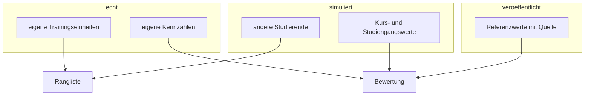
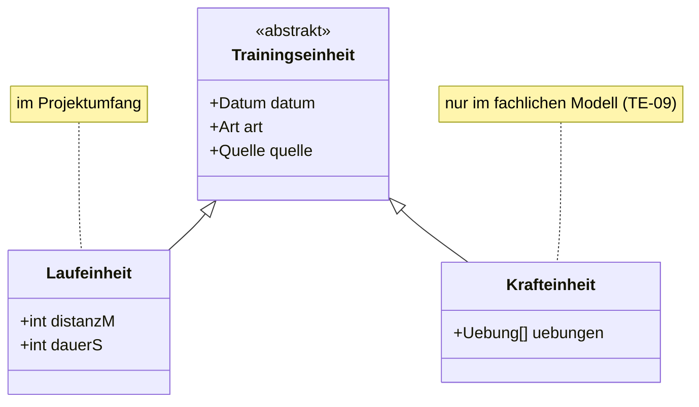
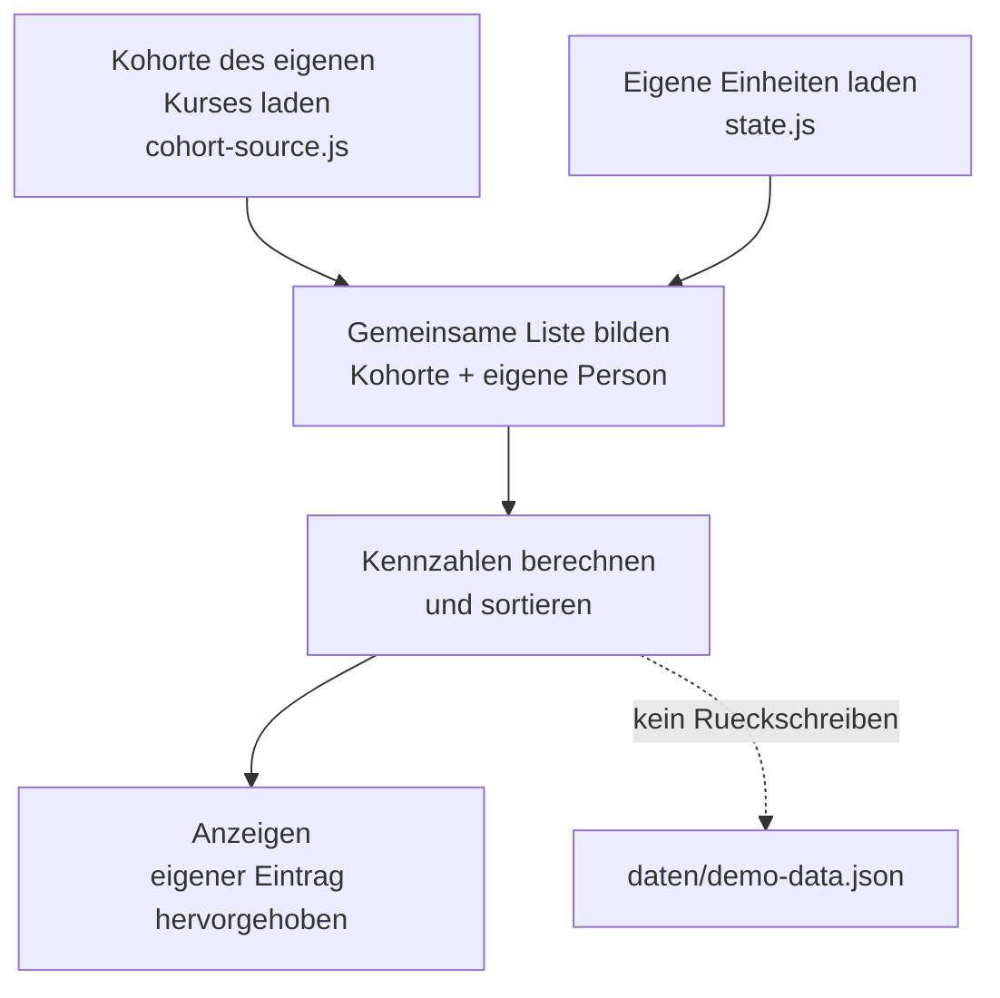

# Datenkonzept

> **Status: Vorschlag.** Dieses Dokument ist ein Entwurf. Es beschreibt einen möglichen Weg und wird verbindlich, sobald das Team ihn annimmt. Jede Angabe steht zur Diskussion. Beschlossene Punkte stehen in `07-technische-entscheidungen.md` mit dem Status entschieden.

## Grundregel

Daten der Person am Bildschirm sind echt. Daten aller anderen Personen sind simuliert. Die Rangliste rechnet über beide Bestände zusammen.

Das gilt für den Zielumfang dieses Projekts. Eine gemeinsame Datenbank ist als Ausbaustufe beschrieben und nicht Teil davon, siehe `08-ausblick.md`.

| Anzeige | Quelle |
|---|---|
| Eigene Trainingshistorie | echt, aus der hochgeladenen CSV-Datei |
| Eigene Kennzahlen und Verläufe | echt, daraus berechnet |
| Andere Studierende | simuliert |
| Kurs- und Studiengangsdurchschnitte | simuliert, eigene Daten fließen ein |
| Eigener Rang | echte Berechnung über den zusammengeführten Bestand |
| Referenzwerte aus der Sportwissenschaft | veröffentlichte Werte mit Quellenangabe |

## Internes Datenformat

Alle Daten liegen im selben Format vor, unabhängig davon, aus welcher App sie stammen und ob sie echt oder simuliert sind. Das Format wird in `js/model.js` festgelegt und gilt als erstes verbindlich; alles Weitere baut darauf auf.

Eine Trainingseinheit trägt mindestens: Datum, Art, Quelle. Eine Laufeinheit ergänzt Distanz in Metern und Dauer in Sekunden.

Das Feld Art bleibt im Format erhalten, obwohl es aktuell nur den Wert `laufen` annimmt. Damit lässt sich Krafttraining später ergänzen, ohne das Format zu ändern.

Einheiten werden im Format ohne Vorsatz gespeichert. Die Umrechnung auf Kilometer, Minuten oder Pace erfolgt erst in der Anzeige.

## Import

Jede Quell-App bekommt ein eigenes Modul unter `js/import/`. Ein Modul nimmt den Inhalt der CSV-Datei entgegen und liefert eine Liste von Trainingseinheiten im internen Format.

| Modul | Quelle | Inhalt |
|---|---|---|
| `strava.js` | `activities.csv` aus dem Strava-Bulk-Export | Datum, Typ, Distanz, Dauer, Höhenmeter |

Zeilen ohne Lauf-Aktivität werden beim Import verworfen. Der Strava-Export enthält auch Radfahrten und andere Aktivitäten.

Apple Health und Google Fit sind nicht vorgesehen. Der Apple-Health-Export ist eine XML-Datei von mehreren hundert Megabyte. Die Google-Fit-Schnittstellen werden zugunsten von Health Connect eingestellt, das keine Web-Schnittstelle anbietet.

Echte Exporte des Teams liegen lokal unter `daten/beispiel-csv/` und dienen als Testdaten. Der Ordner steht in `.gitignore` und wird nicht eingecheckt, weil das Repository für GitHub Pages öffentlich ist.

## Simulierte Kohorte

`daten/demo-data.json` enthält erfundene Studierende in mehreren Kursen und Studiengängen, erzeugt durch `scripts/generate-demo-data.js`.

Das Skript wird einmal ausgeführt, das Ergebnis wird eingecheckt. Zur Laufzeit wird nichts erzeugt, damit die Rangliste bei jedem Aufruf identisch aussieht.

Anforderungen an die erzeugten Werte:

- Die Verteilung der Wochenkilometer ist rechtsschief. Die Mehrheit läuft wenig, wenige laufen viel.
- Pace und Distanz hängen zusammen.
- Die Teilnahme ist unregelmäßig. Es gibt Personen, die im Sommer aufgehört haben.
- Nicht jede Person eines Kurses hat Daten hochgeladen.
- Umfang: vier bis sechs Kurse, zwanzig bis vierzig Personen je Kurs, sechs Monate Historie.
- Ein Kurs enthält weniger als fünf Personen mit Daten. Sonst tritt der Zustand "zu wenige Teilnehmende" nie ein und lässt sich weder prüfen noch vorführen.

## Zusammenführung für die Rangliste

1. Kohorte des eigenen Kurses laden.
2. Eigene Trainingseinheiten aus `localStorage` laden.
3. Eine gemeinsame Liste bilden: Kohorte plus die eigene Person als weiterer Eintrag.
4. Kennzahlen über diese Liste berechnen und sortieren.
5. Anzeigen, eigener Eintrag hervorgehoben.

Die Berechnung unterscheidet nicht zwischen echten und simulierten Einträgen. Das setzt voraus, dass beide Bestände dasselbe Format verwenden.

Das Ergebnis wird nur angezeigt. Zurückgeschrieben wird ausschließlich der eigene Bestand.

## Zustände, die die Oberfläche abdecken muss

| Zustand | Verhalten |
|---|---|
| Noch nichts hochgeladen | Rangliste zeigt die Kohorte, eigener Eintrag fehlt, Hinweis zum Upload |
| Weniger als fünf Personen mit Daten im Kurs | Kein Aggregat, stattdessen Hinweis "zu wenige Teilnehmende" |
| Eigener Rang am Ende der Liste | Rang zusammen mit eigenem Verlauf und Perzentilband anzeigen |

Die Schwelle liegt bei fünf Personen und gilt für Kurse wie für Studiengänge.

Der letzte Punkt ist eine Produktentscheidung. Ein Rang allein wirkt bei geringem Trainingsumfang entmutigend und widerspricht damit dem Zweck der Anwendung.

## Bewertungsebenen

1. Vergleich mit sich selbst über die Zeit. Trägt die Motivation und benötigt keine Fremddaten.
2. Vergleich mit dem Kurs und dem Studiengang. Perzentil innerhalb der Kohorte.
3. Vergleich mit veröffentlichten Normwerten aus `daten/referenzwerte.json`, jeweils mit Quellenangabe für die Seminararbeit.

## Motivationstexte

Die Texte werden während der Entwicklung erzeugt und als Datei ausgeliefert. Zur Laufzeit wählt die Anwendung anhand der erkannten Situation einen passenden Text aus.

Ein Aufruf einer KI-Schnittstelle aus dem Browser scheidet aus, weil der dafür nötige Schlüssel im Quelltext sichtbar wäre. Ein vorbereiteter Textbestand ist außerdem unabhängig von der Netzverbindung im Präsentationsraum.

## Speicherung und Datenschutz

Eigene Daten liegen in `localStorage` und verlassen das Gerät nicht. Es gibt keinen Server, der Trainingsdaten entgegennimmt. `localStorage` ist nötig, weil die Anwendung mehrseitig ist und ein Wechsel von `dashboard.html` zu `rangliste.html` die Seite neu lädt. Daten im Arbeitsspeicher wären dabei verloren, siehe TE-10.

`profil.html` bietet das Löschen der eigenen Daten an.

Gesundheitsdaten sind besondere Kategorien personenbezogener Daten nach Art. 9 DSGVO. Für eine Fallstudie werden deshalb keine echten Trainingsdaten von Mitstudierenden erhoben. Die simulierte Kohorte ist die Folge dieser Entscheidung.

Für den späteren Echtbetrieb sind vorgesehen: Mindestgruppengröße vor Anzeige eines Aggregats, Aufnahme in Ranglisten nur nach ausdrücklicher Zustimmung.
