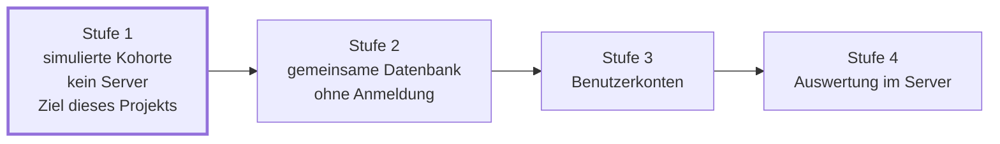
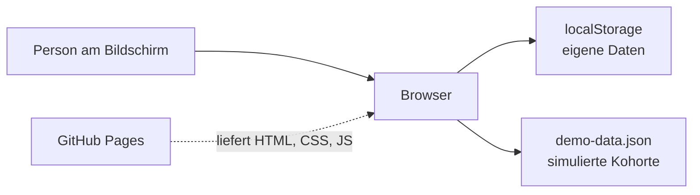
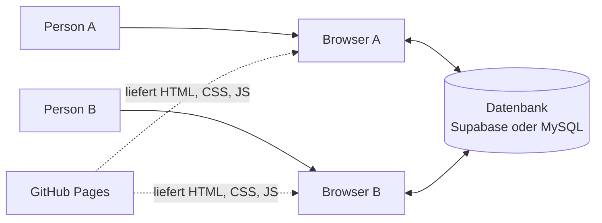

# Ausblick

> **Status: Vorschlag.** Ausbaustufe 1 beschreibt den vorgeschlagenen Zielumfang, die Stufen 2 bis 4 sind Optionen. Nichts davon ist beschlossen. Die Entscheidung zu einer gemeinsamen Datenbasis ist als OP-02 offen.

Dieses Dokument beschreibt den Zielumfang dieses Projekts und welche Ausbaustufen darüber hinaus möglich sind.

Stand heute ist nichts umgesetzt. Die Umsetzung beginnt nach der HTML-Vorlesung am 04.09.2026. Gebaut wird Ausbaustufe 1. Die Stufen 2 bis 4 werden erst nach einer ausdrücklichen Entscheidung gebaut, siehe OP-02.



Gebaut wird Stufe 1. Jede weitere Stufe setzt die vorige voraus.

## Ausbaustufe 1: Zielumfang dieses Projekts

- Sportart Laufen.
- Import einer `activities.csv` aus dem Strava-Bulk-Export.
- Eigene Trainingsdaten in `localStorage` des Browsers.
- Alle anderen Studierenden aus `daten/demo-data.json`, einmal erzeugt und eingecheckt.
- Ranglisten rechnen über eigene und simulierte Daten zusammen.
- Kein Server, keine Benutzerkonten, keine Datenbank.
- Auslieferung über GitHub Pages.

Grenzen dieser Stufe:

- Die Daten liegen an einen Browser gebunden. Ein Wechsel des Geräts verliert sie.
- Es gibt keine echten Mitnutzenden. Die Kohorte ist erfunden.
- Die Angabe der Matrikelnummer wird nicht geprüft.
- Motivationstexte stammen aus einem vorbereiteten Bestand.

Diese Grenzen werden in der Präsentation genannt. Die Analyse- und Vergleichslogik wird produktiv umgesetzt und ist für echte Daten unverändert verwendbar. Simuliert wird die Datenquelle.



## Ausbaustufe 2: gemeinsame Datenbasis ohne Anmeldung

Trainingsdaten liegen in einer Datenbank. Die Zuordnung erfolgt über die eingegebene Matrikelnummer.

Damit entstehen echte Ranglisten. Lädt eine zweite Person Daten hoch, verändert sich die Platzierung der ersten.

Was sich ändert: der Upload legt die Daten in der Datenbank ab, und `cohort-source.js` bezieht die Kohorte von dort. Alles Übrige bleibt unverändert.



Aufwand: etwa ein halber Arbeitstag. Grenze: die Identität wird nicht geprüft. Jede Person kann jede Matrikelnummer eingeben.

## Ausbaustufe 3: Benutzerkonten

Registrierung und Anmeldung mit Passwort.

Bei PHP über `password_hash`, `password_verify` und Sitzungen. Bei Supabase über die eingebaute Benutzerverwaltung.

Aufwand: etwa ein weiterer Arbeitstag. Folge: Sobald echte Studierende echte Trainingsdaten hinterlegen, gelten die Pflichten aus Art. 9 DSGVO tatsächlich. Nötig wären dann Rechtsgrundlage, Einwilligung, Löschmöglichkeit und eine belastbare Datenschutzerklärung. Für eine Fallstudie ist ein Betrieb mit vier Testkonten und eingespielten Daten die angemessene Form.

## Ausbaustufe 4: Auswertung auf dem Server

Aggregationen werden in der Datenbank berechnet.

```sql
create view kurs_rangliste as
select
  s.kurs,
  count(distinct s.id)                        as teilnehmende,
  sum(l.distanz_m) / 1000.0                   as km_gesamt,
  avg(l.dauer_s / (l.distanz_m / 1000.0))     as pace_s_pro_km
from studierende s
join laufeinheiten l on l.studierende_id = s.id
where l.datum >= current_date - interval '30 days'
group by s.kurs
having count(distinct s.id) >= 5;
```

Zwei Wirkungen:

1. Der Browser lädt wenige Zeilen. Ohne die View wären es mehrere tausend Datensätze.
2. Die letzte Zeile setzt die Mindestgruppengröße in der Datenbank durch. Ein Kurs mit vier Teilnehmenden erscheint in der Antwort der Schnittstelle nicht. Die Regel gilt damit auch bei direktem Aufruf der Schnittstelle.

Punkt 2 verlagert die Regel von der Oberfläche in die Schnittstelle. Die Daten eines zu kleinen Kurses werden gar nicht erst ausgeliefert. Das gehört in die Präsentation und in die Seminararbeit.

Zusätzlich möglich: eine Serverfunktion erzeugt Motivationstexte zur Laufzeit über eine KI-Schnittstelle. Der Schlüssel liegt dabei auf dem Server und erscheint nicht im Quelltext. Damit entfällt die Einschränkung aus TE-06.

## Vergleich der Wege

| Kriterium | simulierte Kohorte | Supabase | PHP und MySQL auf Webspace |
|---|---|---|---|
| Bezug zum Kursstoff | HTML, CSS, JS | JavaScript, außerhalb des Stoffs | Vorlesung 7 am 09.10., Folie 13 |
| Aufwand bis Ausbaustufe 2 | entfällt | ca. ein halber Tag | ca. ein Tag |
| Kosten | 0 € | 0 € ohne Zahlungsmittel | ca. 4 € im Monat |
| Betrieb | keiner | fremd betrieben, dauerhaft erreichbar | fremd betrieben, dauerhaft erreichbar |
| Eigener Rechner nötig | nein | nein | nein |
| Besonderes Risiko | keines | Projekt pausiert nach etwa einer Woche ohne Zugriff | keines |
| Serverseitige Auswertung | nein | Views, Funktionen, Edge Functions | SQL-Views, PHP |

Der Betrieb auf einem eigenen Rechner mit Freigabe nach außen wurde geprüft und verworfen. Das WLAN der Hochschule trennt Endgeräte häufig voneinander, und die Erreichbarkeit hängt daran, dass ein bestimmtes Notebook eingeschaltet ist.

## Entscheidungspunkt

Die Entscheidung fällt nach der PHP-Vorlesung am 09.10.2026 und ist als OP-02 in `07-technische-entscheidungen.md` geführt.

Bis dahin ändert sich nichts an der Umsetzung.

Der Schritt auf Ausbaustufe 2 berührt zwei Dateien: `cohort-source.js` und den Schreibweg des Uploads. Ausbaustufe 3 kommt mit einer Anmeldeseite hinzu. Ausbaustufe 4 verlagert Berechnungen aus `analysis/cohort.js` in die Datenbank. Der Schritt auf Ausbaustufe 2 ist von den dreien der kleinste.

## Voraussetzung, damit der Wechsel klein bleibt

Vier Regeln aus der Architektur halten die Anschlussfähigkeit offen. Sie gelten ab sofort, unabhängig davon, welche Ausbaustufe später kommt.

1. `cohort-source.js` ist die einzige Stelle, die auf Daten anderer Personen zugreift.
2. `state.js` ist die einzige Stelle, die eigene Daten liest und schreibt.
3. Eigene und simulierte Daten liegen im selben internen Format vor.
4. `model.js` enthält keine Felder, die nur bei einer bestimmten Quell-App vorkommen.

Diese Regeln halten den Umstieg auf zwei Dateien begrenzt. Ohne sie müsste die Datenschicht neu entwickelt werden.

## Bewusst nicht geplant

Krafttraining in der Webanwendung, siehe TE-09. Im fachlichen Klassendiagramm bleibt es als Erweiterung enthalten.

Weitere Importquellen über Strava hinaus. Apple Health und Google Fit sind ausgeschlossen, siehe `03-datenkonzept.md`.

Eine native App für Telefone. Die Weboberfläche ist für schmale Bildschirme ausgelegt.

Eine Prüfung der Matrikelnummer gegen einen Verzeichnisdienst der DHBW. Im fachlichen Modell ist der Schritt in UC01 beschrieben und in der Umsetzung nicht enthalten.
