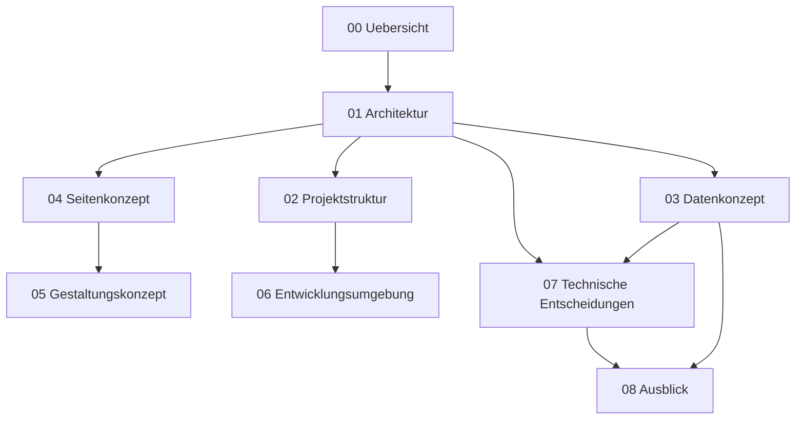

# Dokumentation Web Engineering

Technische Dokumentation der Webanwendung "DHBW Sportler".
Kurs: Webprogrammierung, WWI25AMB, DHBW Mannheim, WS 2026/27.
Dozent: Dipl.-Ing. Dirk Henel. Präsentation: 23.10.2026.

## Ablage: was liegt wo

| Inhalt | Ort |
|---|---|
| Webanwendung, Quellcode, technische Dokumentation | dieses Git-Repository |
| Fallstudie Systemanalyse: Umfeld, Projektauftrag, Use Cases, Entscheidungen, Glossar | Notion |
| UML-Diagramme als Bilddatei, Präsentationen | Google Drive, eingebettet in Notion |

Fachliche Begriffe werden in Notion im Glossar festgelegt. Dieses Repository verwendet
dieselben Begriffe und definiert sie kein zweites Mal.

## Dokumente

| Datei | Inhalt | Status |
|---|---|---|
| `01-architektur.md` | Aufbau der Anwendung, Datenfluss, Auslieferung | teils entschieden |
| `02-projektstruktur.md` | Ordner, Dateien, Namenskonventionen, Zuständigkeiten | Vorschlag |
| `03-datenkonzept.md` | Internes Datenformat, CSV-Import, echte und simulierte Daten | Vorschlag |
| `04-seitenkonzept.md` | Liste aller Seiten mit Zweck und Eigentümer | Vorschlag |
| `05-gestaltungskonzept.md` | CSS-Aufbau, Design-Tokens, Breakpoints | Vorschlag |
| `06-entwicklungsumgebung.md` | Einrichtung, Arbeitsablauf, Veröffentlichung | Vorschlag |
| `07-technische-entscheidungen.md` | Entscheidungen mit Begründung, offene Punkte | verbindlich |
| `08-ausblick.md` | Zielumfang, mögliche Ausbaustufen, Vergleich der Wege | Vorschlag |

**Nur `07-technische-entscheidungen.md` ist verbindlich**, und dort auch nur die
Einträge mit dem Status "entschieden". Alle übrigen Dokumente sind Entwürfe einer
Person und beschreiben einen möglichen Weg. Sie sind zum Widersprechen gedacht.

Wird ein Vorschlag im Team angenommen, wandert er als Eintrag nach
`07-technische-entscheidungen.md` und bekommt dort den Status "entschieden".

Wer neu dazukommt, liest `06-entwicklungsumgebung.md` und danach `01-architektur.md`.

## Stand

Stand heute ist kein Quellcode geschrieben. Die Umsetzung beginnt nach der
HTML-Vorlesung am 04.09.2026. Die Dokumente beschreiben einen vorgeschlagenen
Zielumfang.

Alle Dokumente sind Entwurf. Sie werden fortgeschrieben, sobald eine Entscheidung fällt.
Änderungen an einer Entscheidung werden in `07-technische-entscheidungen.md` nachgetragen,
damit die Begründungen für die Präsentation und die Seminararbeit verfügbar bleiben.
