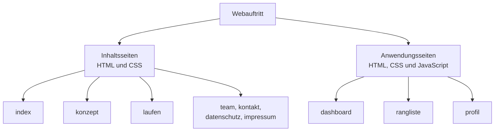
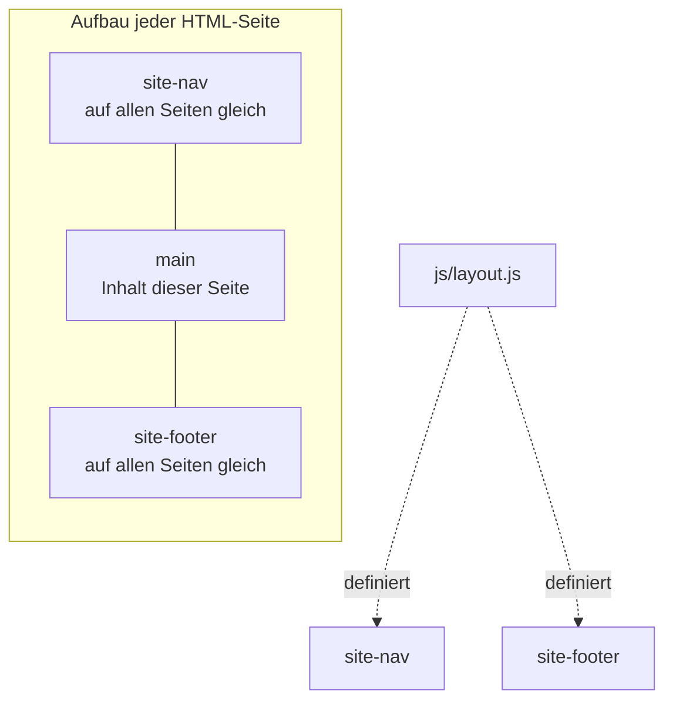
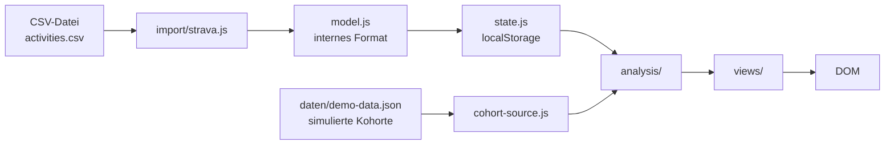

# Architektur

> **Status: teils entschieden, teils Vorschlag.** Entschieden sind die Grundform
> (mehrere HTML-Seiten ohne Framework und ohne Build-Schritt) und das gemeinsame Layout
> über Custom Elements. Der übrige Aufbau — Modulschnitt, Ordnerseams, Hash-Router,
> `<template>`-Muster — ist ein Vorschlag. Der Stand je Punkt steht in
> `07-technische-entscheidungen.md`.

## Grundform

Die Anwendung ist eine mehrseitige Website aus eigenständigen HTML-Dateien. Die
Navigation zwischen Seiten erfolgt über `<a href>` und lädt die jeweilige Datei neu.
Es gibt keinen Router über die gesamte Website und keinen Build-Schritt. Die Dateien
im Repository sind die Dateien, die im Browser ankommen.

Verwendete Techniken: HTML, CSS, JavaScript mit ES-Modulen, `localStorage`,
`fetch` für lokale JSON-Dateien, Custom Elements.

## Zwei Arten von Seiten

**Inhaltsseiten** stellen die Geschäftsidee dar. Startseite, Konzept, Laufen, Team,
Kontakt, Datenschutz, Impressum. Sie bestehen im Kern aus HTML und CSS. JavaScript
beschränkt sich auf das gemeinsame Layout und auf einzelne Bedienelemente wie den
Menü-Umschalter und die Formularprüfung auf `kontakt.html`. Sie verarbeiten keine
Trainingsdaten.

**Anwendungsseiten** verarbeiten Daten. Dashboard, Rangliste, Profil. Sie laden
JavaScript-Module und erzeugen ihre Inhalte zur Laufzeit. Der Zugriff auf eigene Daten
läuft über `state.js`, der auf die simulierte Kohorte über `cohort-source.js`. Die
Seiten selbst greifen auf keine Datenquelle direkt zu.



### Das Unterscheidungsmerkmal

Eine Anwendungsseite verarbeitet Trainingsdaten. Eine Inhaltsseite tut das nicht.

Woher die Daten stammen, ändert die Einteilung nicht. Eigene Daten aus `state.js`,
die simulierte Kohorte aus `cohort-source.js` oder später eine Datenbank führen alle
zur selben Einordnung. Die Einteilung bleibt damit auch nach einem Wechsel auf
Ausbaustufe 2 gültig, siehe `08-ausblick.md`.

Das Merkmal ist nicht "enthält JavaScript". `kontakt.html` prüft ein Formular in
JavaScript und bleibt eine Inhaltsseite, weil dabei keine Trainingsdaten im Spiel sind.
`profil.html` zählt zu den Anwendungsseiten, weil sie über `state.js` die Kurszuordnung
schreibt und die eigenen Daten löscht.

### Woran man es in der Datei erkennt

Bei einer Inhaltsseite steht der Text wörtlich im HTML:

```html
<main>
  <h1>Wie es funktioniert</h1>
  <p>Du exportierst deine Laufdaten aus Strava und laedst die Datei hoch.</p>
</main>
```

Bei einer Anwendungsseite stehen leere Behälter und Vorlagen. Den Inhalt setzt
JavaScript zur Laufzeit ein:

```html
<main>
  <h1>Deine Woche</h1>
  <div id="kennzahlen"></div>
  <canvas id="verlauf"></canvas>

  <template id="vorlage-kachel">
    <div class="kennzahl-kachel">
      <span class="kennzahl-wert"></span>
      <span class="kennzahl-name"></span>
    </div>
  </template>
</main>
<script type="module" src="js/pages/dashboard.js"></script>
```

### Warum die Trennung im Projekt wichtig ist

Die Trennung erlaubt paralleles Arbeiten. An Inhaltsseiten kann ab der zweiten
HTML-Vorlesung am 11.09. gearbeitet werden, ohne dass der Import fertig ist.
Anwendungsseiten setzen die JavaScript-Vorlesung am 02.10. voraus.

Sie hilft außerdem bei der Einzelprüfung nach Folie 4: im Quelltext einer Inhaltsseite
steht Auszeichnung, die sich erklären lässt.

## Gemeinsames Layout

Kopfbereich und Fußbereich sind einmal definiert und werden als Custom Elements
eingebunden:

```html
<body>
  <site-nav></site-nav>
  <main> <!-- seitenspezifischer Inhalt --> </main>
  <site-footer></site-footer>
  <script type="module" src="js/layout.js"></script>
</body>
```

`js/layout.js` definiert beide Elemente. Der aktive Navigationspunkt wird über
`location.pathname` bestimmt und mit `aria-current="page"` markiert. Die Auszeichnung
wird per CSS hervorgehoben und ist zugleich die korrekte Angabe für Screenreader.

Der Kopfbereich erhält in CSS eine feste Mindesthöhe, damit beim Laden kein Sprung
im Layout entsteht.



Der Umfang bleibt auf Kopf- und Fußbereich begrenzt. Ein weitergehendes Layoutsystem
mit verschachtelten Bereichen wird nicht gebaut.

## Skripte je Seite

Jede Anwendungsseite lädt genau ein Einstiegsmodul:

```html
<script type="module" src="js/pages/dashboard.js"></script>
```

Das Modul importiert, was es braucht. Es gibt keine Sammeldatei, die auf allen Seiten
läuft. Ein Fehler im Dashboard-Modul wirkt sich damit auf die Kontaktseite nicht aus.

## Ansichten innerhalb des Dashboards

Das Dashboard wechselt zwischen Übersicht, Verlauf und Vergleich ohne Seitenwechsel. Der
Zustand steht im Hash der Adresse: `dashboard.html#uebersicht`. Ein kleiner Router wertet
`location.hash` aus und reagiert auf das Ereignis `hashchange`.

Damit funktionieren die Zurück-Taste des Browsers und direkte Verweise auf eine
einzelne Ansicht. Der Router bleibt auf diese eine Seite beschränkt.

## Datenfluss



`cohort-source.js` ist die einzige Stelle, die `demo-data.json` liest. Wird die
Kohorte später aus einer anderen Quelle geladen, ändert sich nur diese Datei.

`state.js` ist die einzige Stelle, die `localStorage` liest und schreibt.

## Zustandshaltung

Die Daten der nutzenden Person liegen in `localStorage` als ein JSON-Objekt. Sie
überleben das Schließen des Browsers und verlassen das Gerät nicht.

Die simulierte Kohorte liegt als Datei im Repository und wird nur gelesen. Beide
Bestände werden getrennt gehalten und nie ineinander geschrieben.

## Wiederverwendbare Bausteine

Wiederholte Strukturen wie Ranglisteneinträge oder Trainingskarten werden als
`<template>` in der HTML-Datei hinterlegt und in JavaScript mit `cloneNode` vervielfältigt.
Die Auszeichnung bleibt damit im HTML lesbar. JavaScript setzt nur die Werte ein.

## Auslieferung

Der Produktivstand liegt im Wurzelverzeichnis des Repositories. Veröffentlichung über
GitHub Pages aus dem Hauptzweig. Ein Upload per FTP auf einen Webspace ist ohne
Änderung möglich, da keine Serverfunktionen benötigt werden.

## Zielumfang

Die Anwendung kommt ohne Server aus. Eigene Daten liegen in `localStorage`, alle anderen
Personen stammen aus `daten/demo-data.json`. Es gibt keine Datenbank und keine
Benutzerkonten.

Stand heute ist nichts davon gebaut. Die Umsetzung beginnt am 04.09.2026.

## Erweiterungspunkt

Eine gemeinsame Datenbasis ist vorgesehen und nicht umgesetzt. Sie berührt zwei Dateien:
`cohort-source.js` liest dann aus einer Schnittstelle statt aus der JSON-Datei, und der
Upload schreibt in die Datenbank statt in `localStorage`. Analyse und Darstellung bleiben
unverändert.

Die Wege dorthin, ihr Aufwand und die Entscheidungskriterien stehen in
`08-ausblick.md`. Die Entscheidung fällt nach der PHP-Vorlesung am 09.10.2026 und ist
als OP-02 in `07-technische-entscheidungen.md` geführt.

## Bewusst ausgeschlossen

**Framework wie React.** Drei von vier Teammitgliedern lernen HTML, CSS und JavaScript
im selben Zeitraum. Ein Framework verdeckt genau die Techniken, die der Kurs vermittelt
und prüft.

**Einseitige Anwendung mit globalem Router.** Der Quelltext einer Seite bestünde dann
aus einem leeren Container. Folie 4 der Veranstaltungsunterlagen verlangt, dass jede
Person anhand des Quelltextes einer Unterseite Begriffe erklären kann.

**Build-Schritt mit npm.** Der Kurs arbeitet mit Editor, lokalem Server und FTP.
Ohne Build-Schritt entfällt eine Fehlerquelle vor der Präsentation.

**Eigener Backend-Dienst.** Der Kurs vermittelt keine serverseitige Entwicklung vor
dem 09.10.2026. Gesundheitsdaten unterliegen Art. 9 DSGVO.
