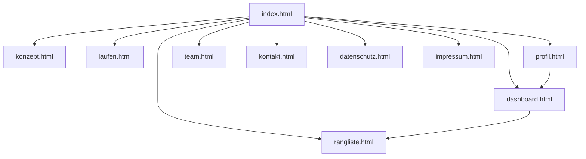
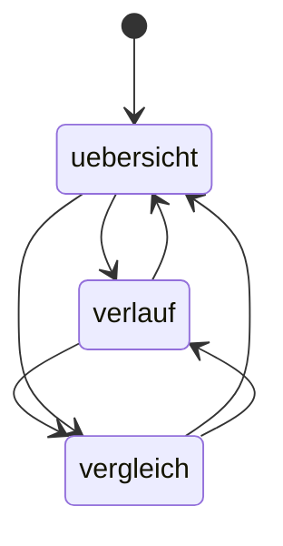
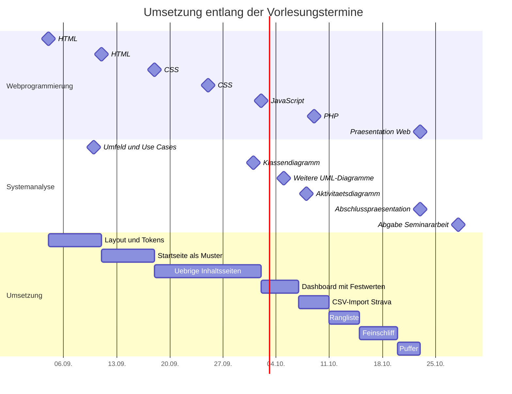

# Seitenkonzept

> **Status: Vorschlag.** Dieses Dokument ist ein Entwurf. Es beschreibt einen möglichen
> Weg und wird verbindlich, sobald das Team ihn annimmt. Jede Angabe steht zur Diskussion.
> Beschlossene Punkte stehen in `07-technische-entscheidungen.md` mit dem Status
> entschieden.

## Seiten

| Datei | Zweck | Art | Eigentum |
|---|---|---|---|
| `index.html` | Einstieg, Idee in einem Satz, Verweis auf Dashboard | Inhalt | offen |
| `konzept.html` | Problem, Lösung, Ablauf in drei Schritten, Datenquellen | Inhalt | offen |
| `laufen.html` | Welche Kennzahlen die Anwendung aus Laufdaten berechnet | Inhalt | offen |
| `dashboard.html` | Eigene Auswertung, CSV-Upload, Diagramme, Motivationstext | Anwendung | offen |
| `rangliste.html` | Vergleich mit Kurs und Studiengang, Kurs gegen Kurs | Anwendung | offen |
| `profil.html` | Matrikelnummer, Kurszuordnung, Demoprofil, Daten löschen | Anwendung | offen |
| `team.html` | Vier Personen, Rollen im Projekt | Inhalt | offen |
| `kontakt.html` | Formular mit Prüfung der Eingaben in JavaScript | Inhalt | offen |
| `datenschutz.html` | Umgang mit Gesundheitsdaten, lokale Speicherung | Inhalt | offen |
| `impressum.html` | Pflichtangaben | Inhalt | offen |

Das Eigentum wird im Team vergeben. Jede Person übernimmt mindestens eine Seite,
die sie selbst schreibt.

Die Navigation ist auf allen Seiten identisch und erreicht jede Seite. Die zusätzlichen
Pfeile zeigen Wege, die in den Seiteninhalten verlinkt sind.

## Ansichten im Dashboard

Der Wechsel erfolgt ohne Seitenwechsel über den Hash.

| Hash | Inhalt |
|---|---|
| `#uebersicht` | Distanz, Pace und Häufigkeit der laufenden Woche, Motivationstext |
| `#verlauf` | Verlauf über vier und zwölf Wochen, persönliche Bestwerte |
| `#vergleich` | Eigene Werte gegen Kurs, Studiengang und Referenzwerte |

Der Wechsel ändert nur den Hash. Die Seite wird nicht neu geladen.

## Interaktive Elemente

| Element | Seite | Technik |
|---|---|---|
| Navigation mit aktivem Punkt | alle | Custom Element, `aria-current` |
| Menü für schmale Bildschirme | alle | Umschalter in JavaScript |
| CSV-Upload per Auswahl und Ablegen | `dashboard` | `File`-Schnittstelle, `FileReader` |
| Wechsel der Ansicht | `dashboard` | Hash-Router |
| Zeitraumfilter Woche, Monat, Jahr | `dashboard` | Neuberechnung und Neuzeichnen |
| Diagramme | `dashboard`, `rangliste` | `canvas` oder eingebettetes SVG |
| Umschalten Kurs, Studiengang | `rangliste` | Neuberechnung |
| Demoprofil auswählen | `dashboard` | vorbereitete Datensätze laden |
| Formularprüfung | `kontakt` | HTML-Prüfattribute und JavaScript |

Das Demoprofil dient der Präsentation. Damit lässt sich der Funktionsumfang zeigen,
ohne im Vortrag eine Datei hochzuladen.

## Reihenfolge der Umsetzung

1. Gemeinsames Layout, `variables.css`, Navigation, Fußbereich.
2. `index.html` als Muster für Aufbau und Gestaltung.
3. Übrige Inhaltsseiten, parallel durch das Team.
4. `dashboard.html` mit fest hinterlegten Werten.
5. CSV-Import für Strava.
6. Rangliste mit der simulierten Kohorte.
7. Motivationstexte, Feinschliff, Barrierefreiheit.

Die Schritte 1 bis 3 laufen nach den HTML- und CSS-Vorlesungen am 04.09., 11.09.,
18.09. und 25.09. Die Schritte 4 bis 6 setzen die JavaScript-Vorlesung am 02.10. voraus.

Die Termine der Fallstudie Systemanalyse binden dieselben vier Personen. Der 23.10.
trägt beide Abschlusspräsentationen. Die letzten drei Tage vor dem 23.10. sind als
Puffer eingeplant und ohne Aufgabe.
