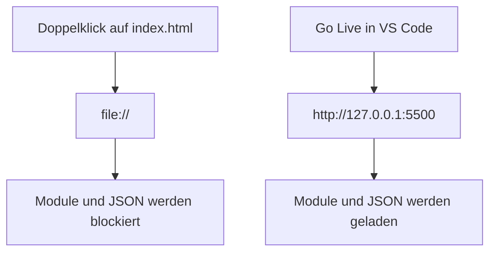

# Entwicklungsumgebung

> **Status: Vorschlag.** Dieses Dokument ist ein Entwurf. Es beschreibt einen möglichen
> Weg und wird verbindlich, sobald das Team ihn annimmt. Jede Angabe steht zur Diskussion.
> Beschlossene Punkte stehen in `07-technische-entscheidungen.md` mit dem Status
> entschieden.

## Einrichtung, einmalig

1. **Git** installieren: https://git-scm.com, Standardeinstellungen übernehmen.
2. **VS Code** installieren: https://code.visualstudio.com
3. **Erweiterung Live Server** installieren. In VS Code links auf das Symbol
   "Extensions", `Live Server` suchen, Install.
4. **Repository klonen.** `Strg+Shift+P`, `Git: Clone` eingeben, die Adresse des
   Repositories einfügen, Ordner wählen, geöffnetes Repository bestätigen.

Node.js, npm und ein Build-Werkzeug werden nicht benötigt.

## Arbeiten

`index.html` im Editor öffnen, unten rechts auf **Go Live** klicken. Der Browser öffnet
`http://127.0.0.1:5500`. Änderungen an einer Datei erscheinen nach dem Speichern
sofort im Browser.

## Warum die Datei nicht per Doppelklick geöffnet wird

Beim Doppelklick öffnet der Browser die Datei über `file://`. In diesem Modus
verweigert er zwei Dinge, die die Anwendung benötigt:

- das Laden von JavaScript-Modulen untereinander über `import`
- das Lesen von `daten/demo-data.json` über `fetch`

Live Server liefert dieselben Dateien über `http://` aus und beides funktioniert.
Der Server liefert ausschließlich Dateien aus. Es läuft kein Programmcode auf ihm.

## Zusammenarbeit mit Git

Gearbeitet wird auf dem Hauptzweig. Jede Person besitzt eigene Dateien, wodurch
Konflikte selten sind.

Ablauf vor jeder Arbeitssitzung:

1. Linke Leiste, Symbol "Source Control", **Sync Changes**. Damit ist der Stand aktuell.
2. Arbeiten und speichern.
3. Nachricht eintippen, Haken anklicken, **Sync Changes**.

Regeln:

- Vor dem Beginn synchronisieren, am Ende einer Sitzung synchronisieren.
- Nur eigene Dateien bearbeiten. Änderungen an `variables.css`, `base.css`,
  `layout.css` und `js/layout.js` vorher absprechen.
- Commit-Nachrichten deutsch und beschreibend: `Kontaktseite: Formularpruefung ergaenzt`.

## Browser

Entwickelt wird gegen aktuelle Versionen von Chrome, Edge und Firefox. Safari lässt
sich unter Windows nicht installieren und wird nur geprüft, falls jemand im Team ein
iPhone oder einen Mac hat. Vor der Präsentation wird die Seite in mindestens zwei
Browsern und auf einem Telefon geprüft.

Die Entwicklerwerkzeuge öffnen sich mit `F12`. Die Registerkarte "Console" zeigt Fehler
in JavaScript. Die Geräteansicht simuliert schmale Bildschirme.

## Veröffentlichung

GitHub Pages aus dem Hauptzweig, Quelle Wurzelverzeichnis. Die Einstellung
"/docs folder" bleibt ungenutzt, da `docs/` die Dokumentation enthält.

Damit steht eine öffentliche Adresse zur Verfügung, die sich im Vortrag am Telefon
öffnen lässt.

Ein Upload per FTP auf einen Webspace ist gleichwertig möglich. Kopiert werden alle
Dateien außer `docs/`, `scripts/`, `daten/beispiel-csv/` und `.git/`.

## Testdaten

Unter `daten/beispiel-csv/` liegen echte Exporte des Teams. Jede Person exportiert
ihre Daten aus der eigenen App und legt die Datei dort ab. Damit wird der Import gegen
echte Formate entwickelt.

Der Ordner steht in `.gitignore`. Die Dateien bleiben auf den eigenen Rechnern, weil
das Repository für GitHub Pages öffentlich ist. Zum Teilen genügt die WhatsApp-Gruppe.
