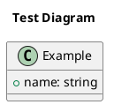

# PlantUML Setup Guide for DHBW Fitness App Team

## Option 1: Server Render (Recommended, Easiest)

This approach uses the PlantUML online server to render diagrams. No local Java or Graphviz installation is required.

### Step 1: Install the PlantUML VS Code Extension

1. Open VS Code.
2. Go to Extensions (Ctrl+Shift+X).
3. Search for "PlantUML" by jebbs.
4. Click Install.

### Step 2: Configure the Extension to Use Server Render

1. Open VS Code Settings (Ctrl+,).
2. Search for "PlantUML server".
3. Set `Plantuml: Server` to `https://www.plantuml.com/plantuml`.
4. Ensure `Plantuml: Render` is set to `PlantUMLServer`.

Alternative: edit `settings.json` directly:

```json
{
  "plantuml.server": "https://www.plantuml.com/plantuml",
  "plantuml.render": "PlantUMLServer"
}
```

### Step 3: Verify Installation

1. Create a new file named `test.puml`.
2. Paste the following content:



3. Press **Alt+D** (or **Option+D** on Mac) to open the preview.
4. You should see a class diagram rendered on the right.

---

## Option 2: Local Render (Requires Java and Graphviz)

Use this if you need offline rendering or cannot rely on the online server.

### Prerequisites

1. **Java**: Version 11 or higher. Check with `java -version`.
2. **Graphviz**: The `dot` command-line tool.

### Windows: Install Graphviz

Run PowerShell as Administrator and execute:

```powershell
choco install graphviz
```

After installation, restart VS Code and verify with:

```bash
dot -V
```

### Mac: Install Graphviz

```bash
brew install graphviz
```

### Linux: Install Graphviz

```bash
sudo apt-get install graphviz
```

### Configure Local Render in VS Code

1. Open VS Code Settings.
2. Set `Plantuml: Render` to `Local`.
3. Set `Plantuml: Jar` to the path of `plantuml.jar` if it is not in the default location.

### Verify Installation

1. Create a new file named `test.puml`.
2. Paste the test content from Option 1.
3. Press **Alt+D** to preview.

---

## How to Create and Export Diagrams

### Create a Diagram

1. Create a file with the `.puml` extension (e.g., `use_case.puml`).
2. Start every diagram with `@startuml` and end with `@enduml`.
3. Use PlantUML syntax to define diagram elements.

### Preview a Diagram

- Press **Alt+D** to open a live preview side panel.
- The preview updates automatically as you edit the file.

### Export a Diagram

1. Open the `.puml` file.
2. Press **Ctrl+Shift+P** to open the Command Palette.
3. Type and select `PlantUML: Export Current Diagram`.
4. Choose the desired format:
   - `png` for images
   - `svg` for scalable vector graphics
   - `pdf` for documents
   - `eps` for print
5. The exported file appears in an `out` folder next to the `.puml` file.

---

## Useful PlantUML Commands in VS Code

| Command | Shortcut / Method |
|---|---|
| Preview current diagram | Alt+D |
| Export current diagram | Ctrl+Shift+P -> PlantUML: Export Current Diagram |
| Export all diagrams in workspace | Ctrl+Shift+P -> PlantUML: Export Current File Diagrams |
| Export to specific format | Select format in the export dialog |

---

## Project File Organization

Place all PlantUML source files in the `fallstudie_uml/` directory:

```
fallstudie_uml/
  use_case_diagram.puml
  class_diagram.puml
  activity_diagram.puml
  ...
```

Exported images will appear in:

```
fallstudie_uml/out/
  use_case_diagram.png
  class_diagram.png
  ...
```

---

## References

- PlantUML Official Site: https://plantuml.com/
- VS Code Extension: https://marketplace.visualstudio.com/items?itemName=jebbs.plantuml
- Use Case Diagram Syntax: https://plantuml.com/use-case-diagram
- Class Diagram Syntax: https://plantuml.com/class-diagram
- Activity Diagram Syntax: https://plantuml.com/activity-diagram-beta
