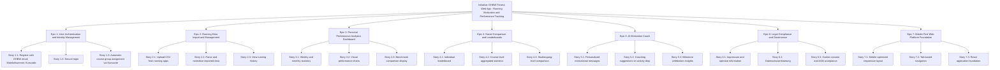

# Requirements Hierarchy Tree

```mermaid
graph TD
    INIT["Initiative: DHBW Fitness Web App - Running Motivation and Performance Tracking"]

    INIT --> E1["Epic 1: User Authentication and Identity Management"]
    INIT --> E2["Epic 2: Running Data Import and Management"]
    INIT --> E3["Epic 3: Personal Performance Analytics Dashboard"]
    INIT --> E4["Epic 4: Social Comparison and Leaderboards"]
    INIT --> E5["Epic 5: AI Motivation Coach"]
    INIT --> E6["Epic 6: Legal Compliance and Governance"]
    INIT --> E7["Epic 7: Mobile-First Web Platform Foundation"]

    E1 --> S1_1["Story 1.1: Register with DHBW email, Matrikelnummer, Kurscode"]
    E1 --> S1_2["Story 1.2: Secure login"]
    E1 --> S1_3["Story 1.3: Automatic course group assignment via Kurscode"]

    E2 --> S2_1["Story 2.1: Upload CSV from running apps"]
    E2 --> S2_2["Story 2.2: Parse and normalize imported data"]
    E2 --> S2_3["Story 2.3: View running history"]

    E3 --> S3_1["Story 3.1: Weekly and monthly statistics"]
    E3 --> S3_2["Story 3.2: Visual performance charts"]
    E3 --> S3_3["Story 3.3: Benchmark comparison display"]

    E4 --> S4_1["Story 4.1: Individual leaderboard"]
    E4 --> S4_2["Story 4.2: Course-level aggregated statistics"]
    E4 --> S4_3["Story 4.3: Studiengang-level comparison"]

    E5 --> S5_1["Story 5.1: Personalized motivational messages"]
    E5 --> S5_2["Story 5.2: Coaching suggestions on activity drop"]
    E5 --> S5_3["Story 5.3: Milestone celebration insights"]

    E6 --> S6_1["Story 6.1: Impressum and operator information"]
    E6 --> S6_2["Story 6.2: Datenschutzerklaerung"]
    E6 --> S6_3["Story 6.3: Cookie consent and AGB acceptance"]

    E7 --> S7_1["Story 7.1: Mobile-optimized responsive layout"]
    E7 --> S7_2["Story 7.2: Tab-based navigation"]
    E7 --> S7_3["Story 7.3: React application foundation"]
```
